# Taskify - Uygulama Akış Dokümantasyonu

Bu belge, Taskify akıllı görev yönetim uygulamasının tüm işleyişini detaylı şekilde açıklamaktadır.

---

## 📑 İçindekiler

1. [Genel Mimari](#-genel-mimari)
2. [Kullanıcı Akışları](#-kullanıcı-akışları)
3. [NLP Analiz Akışı](#-nlp-analiz-akışı)
4. [Görev Yönetimi Akışı](#-görev-yönetimi-akışı)
5. [Grup Yönetimi Akışı](#-grup-yönetimi-akışı)
6. [İstatistik ve AI Yorum Akışı](#-i̇statistik-ve-ai-yorum-akışı)
7. [Veritabanı İlişkileri](#-veritabanı-i̇lişkileri)
8. [API Endpoint Akışları](#-api-endpoint-akışları)

---

## 🏗️ Genel Mimari

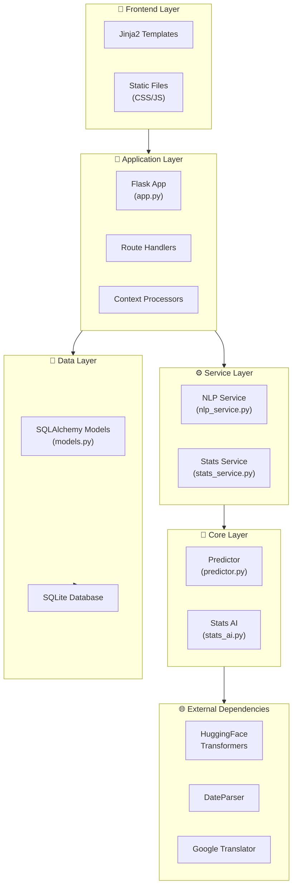

### Katman Açıklamaları

| Katman | Dosyalar | Sorumluluk |
|--------|----------|------------|
| **Frontend** | `templates/`, `static/` | HTML şablonları, CSS stilleri, JavaScript |
| **Application** | `app.py`, `config.py` | Flask routing, request handling, session yönetimi |
| **Service** | `services/nlp_service.py`, `services/stats_service.py` | İş mantığı, AI toggle kontrolü |
| **Core** | `core/predictor.py`, `core/stats_ai.py` | NLP algoritmaları, AI modelleri |
| **Data** | `models.py`, `instance/taskify.db` | Veritabanı modelleri ve ilişkileri |

---

## 👤 Kullanıcı Akışları

### Kayıt Akışı

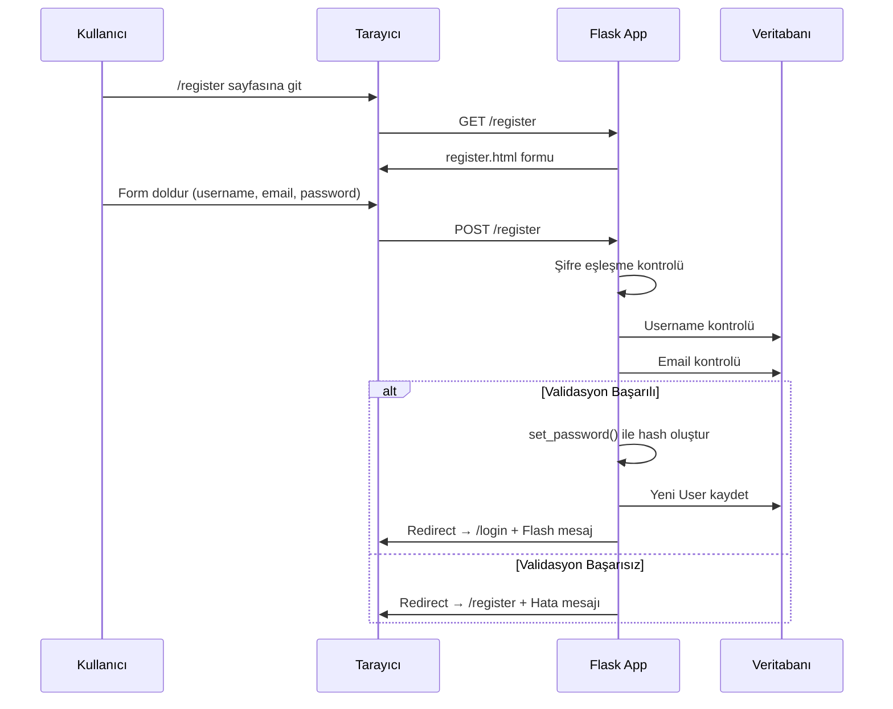

**Kayıt Süreci Detayları:**

1. **Form Validasyonu**
   - Şifre ve onay kontrolü
   - Kullanıcı adı benzersizlik kontrolü
   - E-posta benzersizlik kontrolü

2. **Güvenlik**
   - `werkzeug.security.generate_password_hash()` ile şifre hashleme
   - PBKDF2-SHA256 algoritması

3. **Varsayılan Ayarlar**
   - `role`: 'user'
   - `preferred_language`: Mevcut dil tercihi
   - `ai_features_enabled`: True

---

### Giriş Akışı

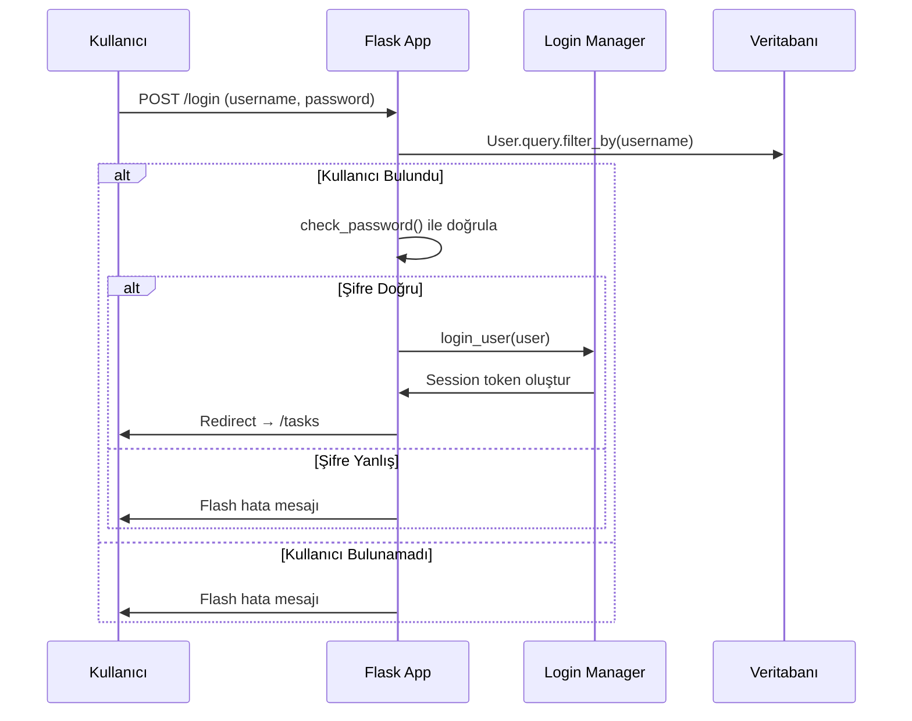

**Oturum Yönetimi:**

- Flask-Login extension ile session yönetimi
- `@login_required` decorator ile koruma
- Otomatik yönlendirme (next parameter)

---

## 🧠 NLP Analiz Akışı

### Akış Diyagramı

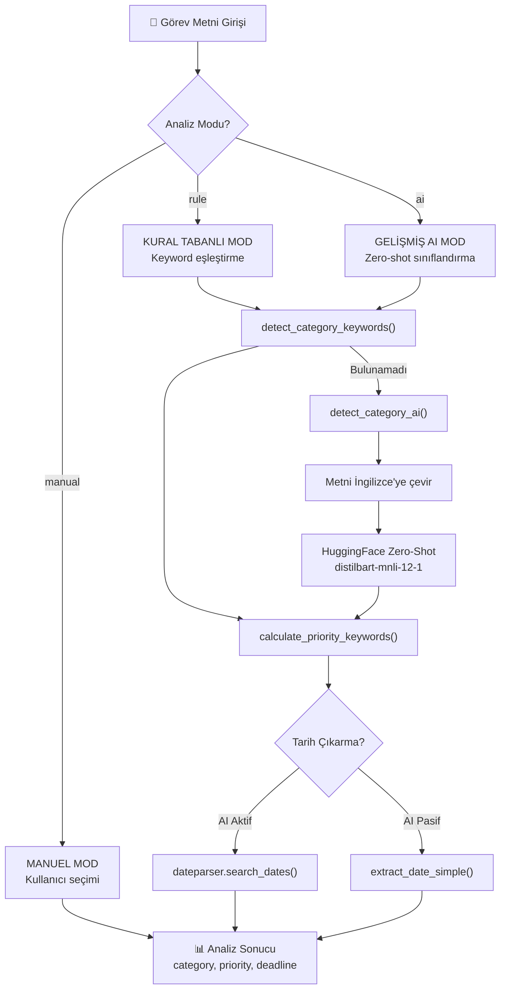

### Analiz Modları Detayı

#### 1. Manuel Mod
```
Kullanıcı tüm değerleri kendisi seçer
├── Kategori: Dropdown'dan seçim
├── Öncelik: 1-2-3 seçimi
└── Deadline: Tarih picker
```

#### 2. Kural Tabanlı Mod (Varsayılan)

**Kategori Tespiti:**

| Kategori | Türkçe Anahtar Kelimeler | İngilizce Anahtar Kelimeler |
|----------|--------------------------|----------------------------|
| **Work** | toplantı, rapor, sunum, proje, ofis, kod | meeting, report, project, code, deadline |
| **Personal** | alışveriş, ev, aile, arkadaş, tatil | shopping, home, family, friend, vacation |
| **Health** | doktor, hastane, ilaç, egzersiz, spor | doctor, hospital, medicine, gym, exercise |
| **Education** | ders, sınav, ödev, okul, kurs, kitap | lesson, exam, homework, school, course |
| **Finance** | fatura, ödeme, banka, vergi, maaş | bill, payment, bank, tax, salary |

**Öncelik Hesaplama:**

```python
# Yüksek Öncelik Kelimeleri (pozitif puan)
'acil': 50, 'hemen': 40, 'kritik': 50, 'bugün': 45
'urgent': 50, 'critical': 50, 'asap': 45, 'important': 30

# Düşük Öncelik Kelimeleri (negatif puan)
'belki': -20, 'sonra': -15, 'acele yok': -25
'maybe': -20, 'later': -15, 'no rush': -25

# Deadline Aciliyeti
gecikmiş: +70, bugün: +60, yarın: +45, 3 gün içinde: +30

# Sonuç
puan >= 40 → Yüksek (1)
puan >= 15 → Normal (2)
puan < 15  → Düşük (3)
```

#### 3. Gelişmiş AI Mod

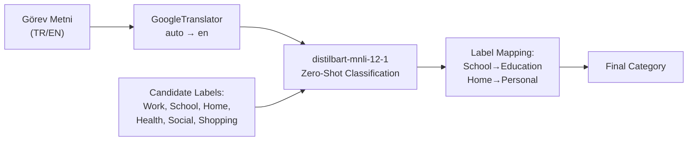

**AI Model Detayları:**
- Model: `valhalla/distilbart-mnli-12-1`
- Yöntem: Zero-shot sınıflandırma
- Confidence Threshold: 0.4
- Çeviri: `deep_translator.GoogleTranslator`

---

### Tarih Çıkarma Akışı

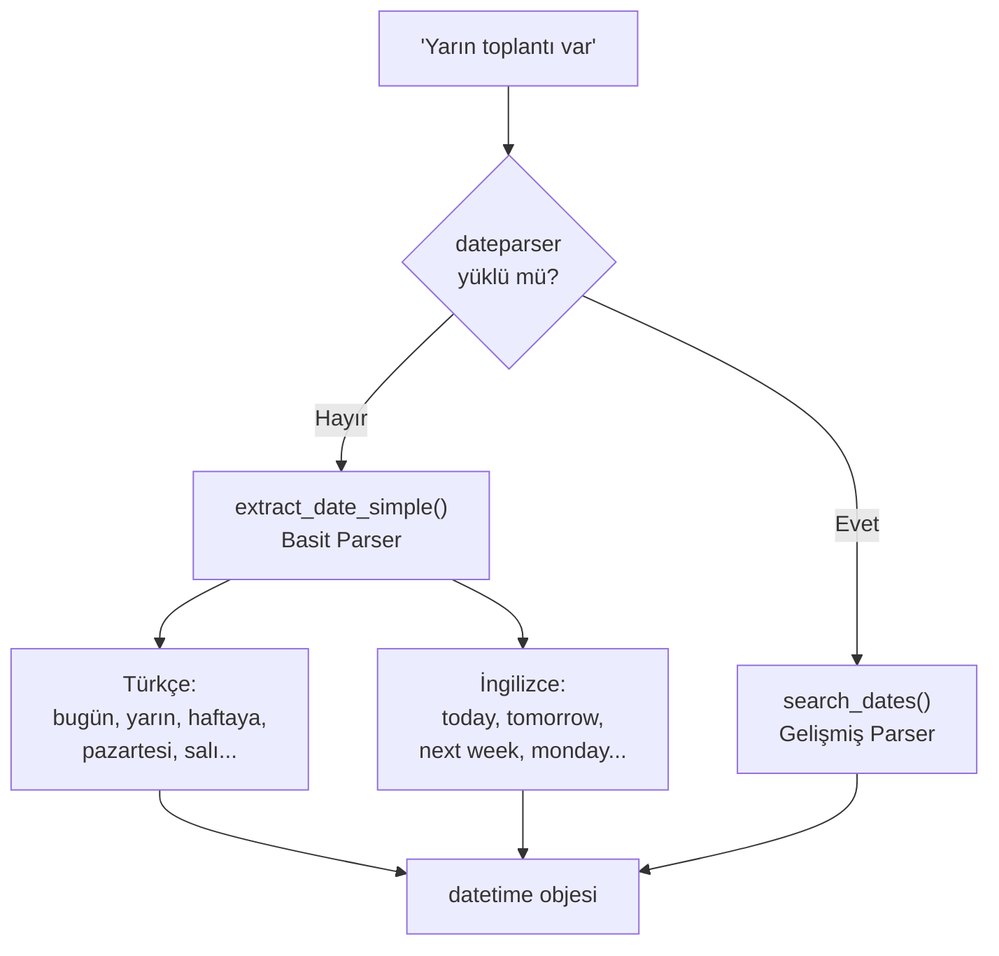

---

## ✅ Görev Yönetimi Akışı

### Görev Ekleme Akışı

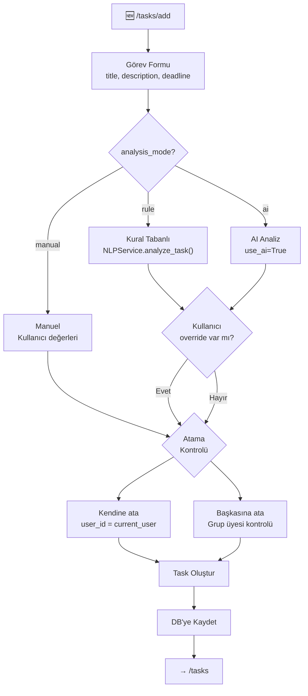

### Görev Durumu Değişikliği

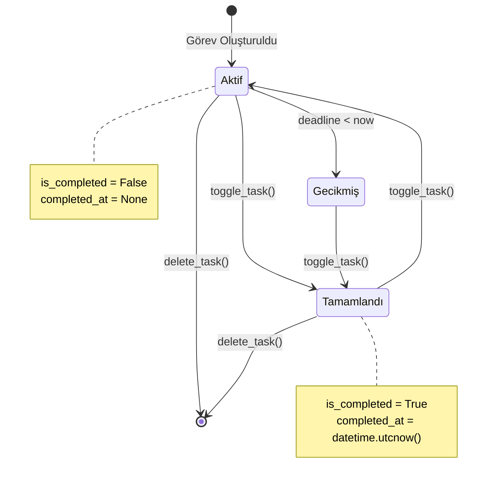

### Görev Listesi Sıralama

```python
# Aktif görevler sıralaması
active_tasks_sorted = sorted(
    active_tasks,
    key=lambda t: (
        t.priority,           # 1. Öncelik (1 > 2 > 3)
        t.deadline or max     # 2. Deadline (yakın olanlar önce)
    )
)
```

### Deadline Uyarıları

| Durum | Renk | İkon | Mesaj Anahtarı |
|-------|------|------|----------------|
| Gecikmiş | `danger` | ⚠️ exclamation-triangle | `deadline_overdue` |
| Bugün | `warning` | 🔥 fire | `deadline_today` |
| Yarın | `warning` | ⏰ clock-fill | `deadline_tomorrow` |
| 2-3 gün | `info` | 🕐 clock | `deadline_soon` |
| Bu hafta | `secondary` | 📅 calendar-week | `deadline_this_week` |

---

## 👥 Grup Yönetimi Akışı

### Grup İlişkileri

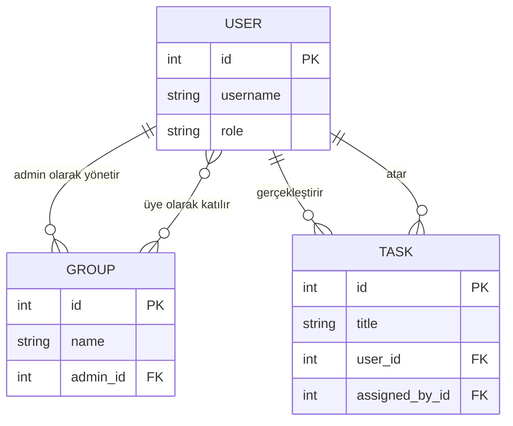

### Görev Atama Akışı

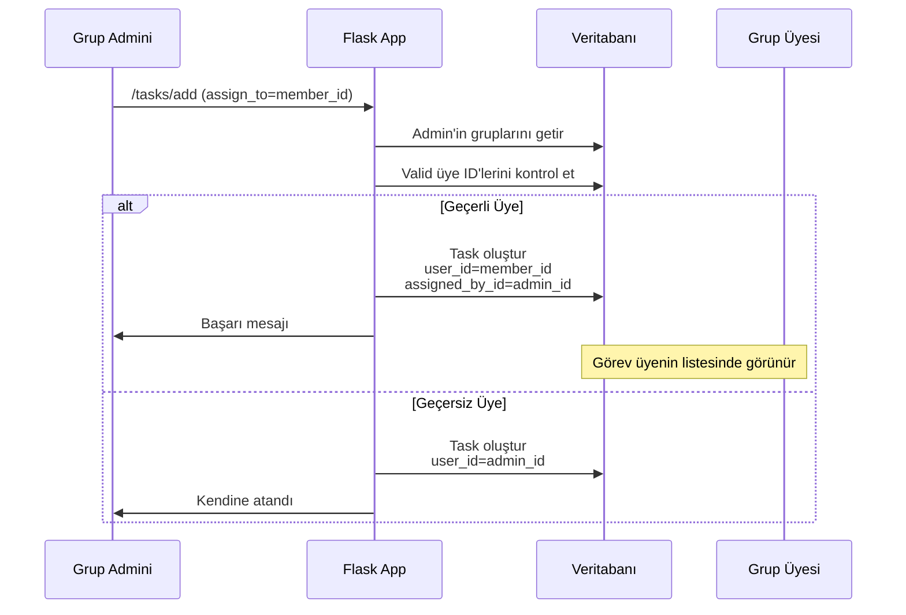

---

## 📊 İstatistik ve AI Yorum Akışı

### İstatistik Hesaplama Pipeline

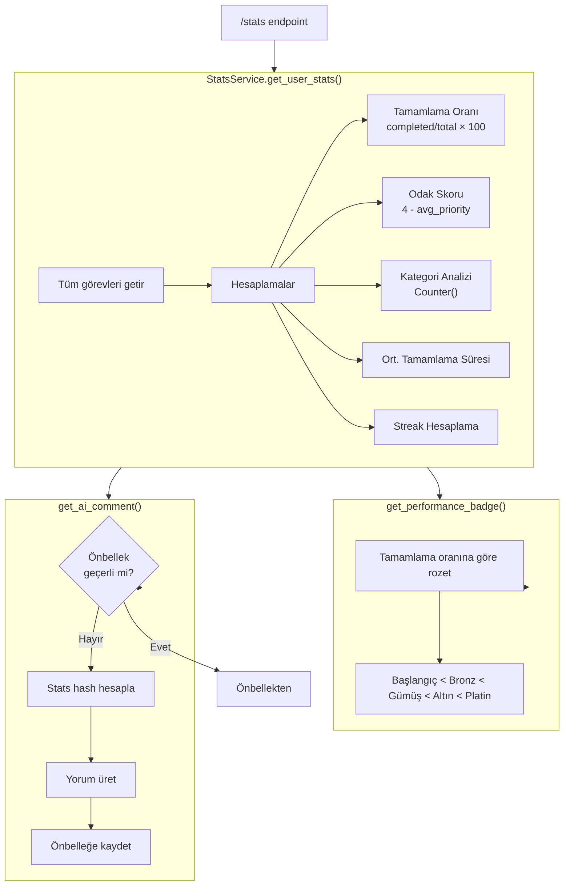

### AI Yorum Üretimi

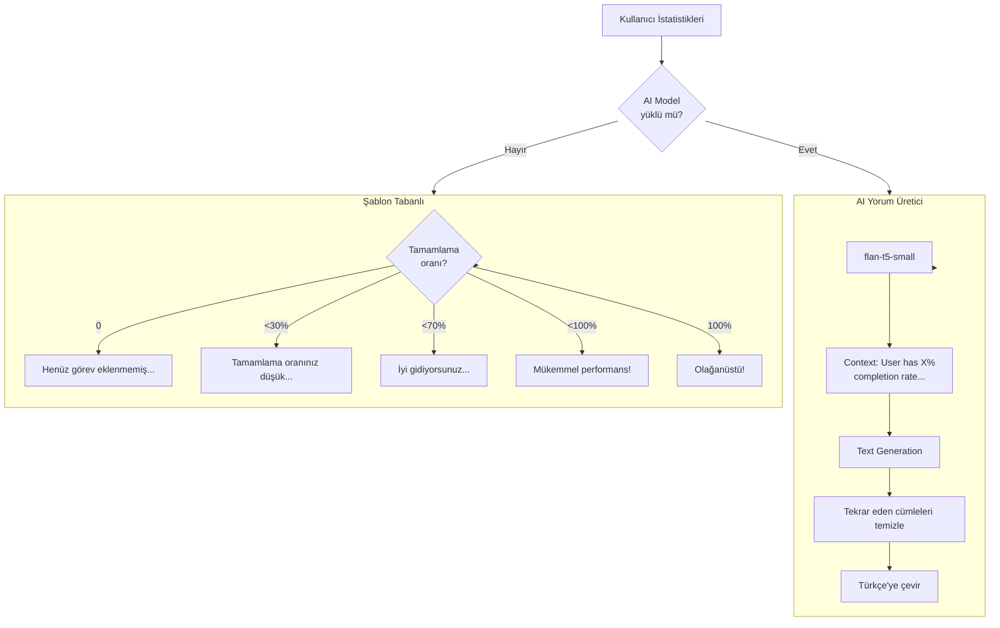

### Önbellekleme Stratejisi

```python
# Cache kontrol akışı
current_hash = md5(f"{total}_{completed}_{rate}")

if user.ai_comment_cache and user.stats_hash == current_hash:
    return user.ai_comment_cache  # Önbellekten

# Yeni yorum üret
comment = generate_comment(stats)

# Önbelleğe kaydet
user.ai_comment_cache = comment
user.stats_hash = current_hash
user.ai_comment_updated_at = datetime.utcnow()
db.session.commit()
```

---

## 💾 Veritabanı İlişkileri

### ER Diyagramı

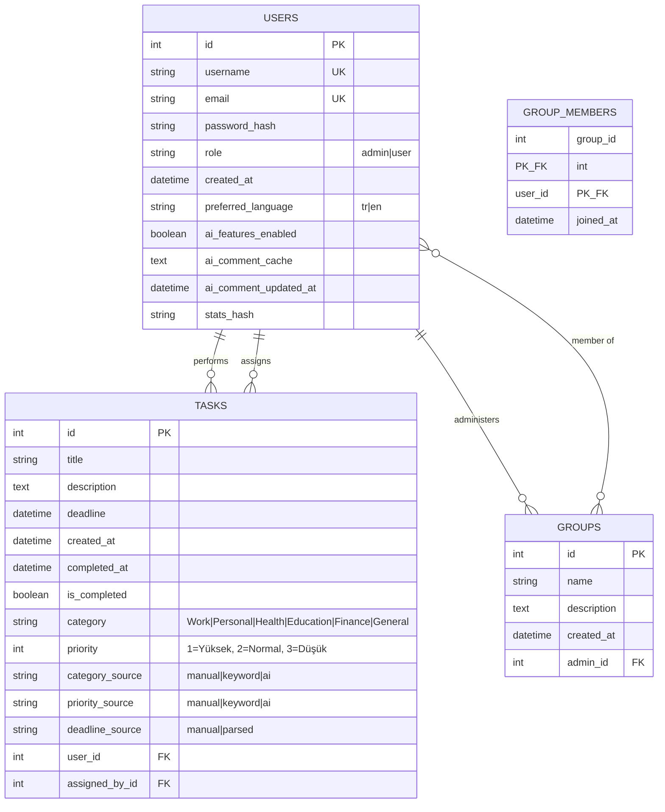

### İlişki Özeti

| İlişki | Tip | Açıklama |
|--------|-----|----------|
| User → Tasks (performer) | 1:N | `user.tasks` - Kullanıcının yapacağı görevler |
| User → Tasks (creator) | 1:N | `user.created_tasks` - Kullanıcının atadığı görevler |
| User → Groups (admin) | 1:N | `user.administered_groups` - Yönettiği gruplar |
| User ↔ Groups (member) | N:M | `group_members` tablosu ile |

---

## 🔌 API Endpoint Akışları

### Gerçek Zamanlı Analiz API

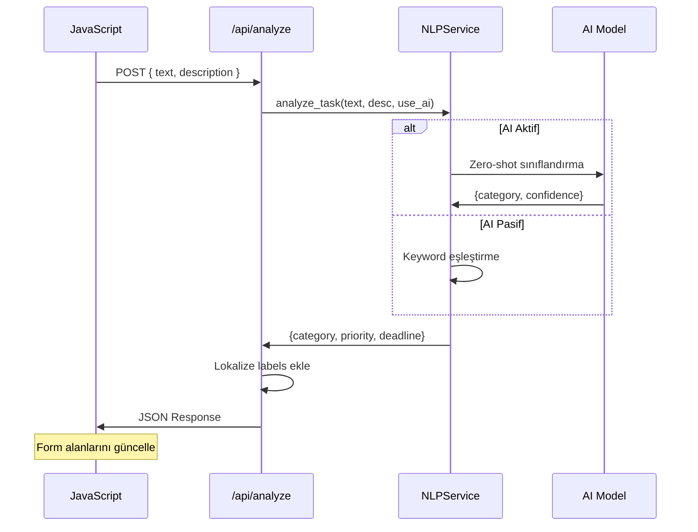

**Request:**
```json
POST /api/analyze
{
    "text": "Acil toplantı yarın",
    "description": "Müşteri ile görüşme"
}
```

**Response:**
```json
{
    "category": "Work",
    "category_display": "İş",
    "category_source": "keyword",
    "priority": 1,
    "priority_display": "Yüksek",
    "priority_source": "keyword",
    "deadline": "2025-01-22",
    "deadline_formatted": "2025-01-22",
    "deadline_source": "simple_parser"
}
```

### Tüm API Endpoints

| Endpoint | Method | Açıklama | Auth |
|----------|--------|----------|------|
| `/api/analyze` | POST | Gerçek zamanlı görev analizi | ✅ |
| `/api/stats` | GET | Kullanıcı istatistikleri | ✅ |
| `/api/nlp-status` | GET | NLP servis durumu | ✅ |

---

## 🌍 Dil Desteği Akışı

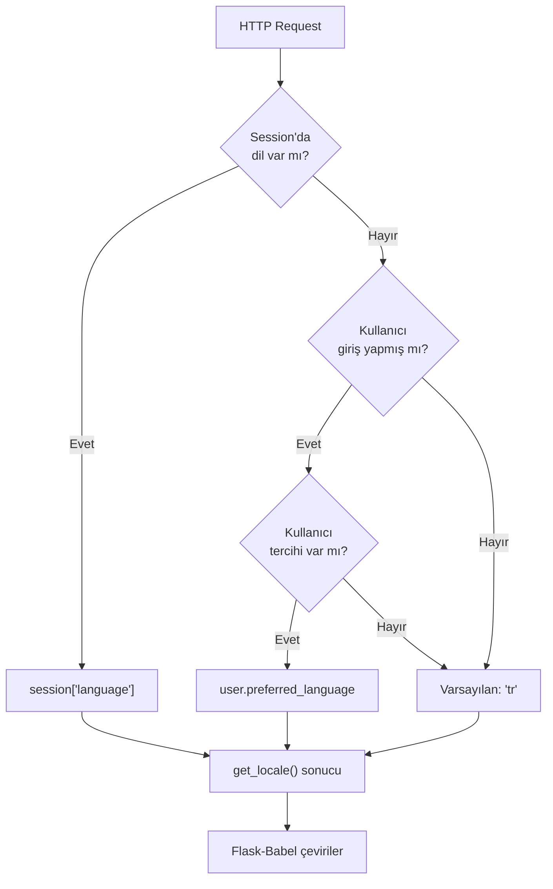

### Dil Değiştirme

```
GET /set-language/<language>
├── Session güncelle
├── Kullanıcı tercihi güncelle (giriş yapmışsa)
└── Önceki sayfaya yönlendir
```

---

## 🔧 Yapılandırma Akışı

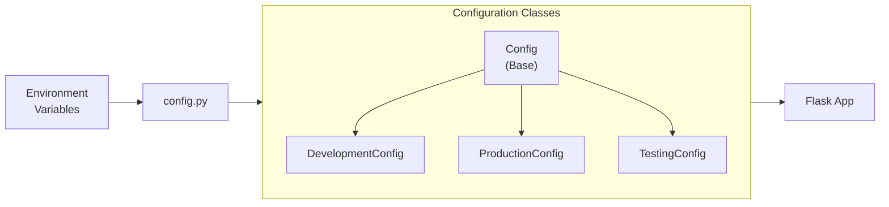

### Önemli Yapılandırma Ayarları

| Ayar | Varsayılan | Açıklama |
|------|------------|----------|
| `AI_ENABLED` | True | Tüm AI özelliklerini aç/kapat |
| `AI_CATEGORY_ENABLED` | True | Kategori tahminini aç/kapat |
| `AI_PRIORITY_ENABLED` | True | Öncelik tahminini aç/kapat |
| `AI_COMMENT_ENABLED` | True | AI yorum üretimini aç/kapat |
| `AI_DATE_PARSER_ENABLED` | True | Gelişmiş tarih ayrıştırıcı |
| `AI_CONFIDENCE_THRESHOLD` | 0.4 | Minimum AI güven skoru |
| `BABEL_DEFAULT_LOCALE` | 'tr' | Varsayılan dil |
| `BABEL_SUPPORTED_LOCALES` | ['tr', 'en'] | Desteklenen diller |

---

## 📝 Özet

Taskify, modern bir görev yönetimi uygulamasıdır ve şu temel akışları içerir:

1. **Kullanıcı Akışı**: Kayıt → Giriş → Profil Yönetimi
2. **Görev Akışı**: Oluştur → (NLP Analizi) → Listele → Tamamla/Sil
3. **Grup Akışı**: Grup Oluştur → Üye Ekle → Görev Ata
4. **İstatistik Akışı**: Veri Topla → Hesapla → AI Yorum → Rozet Ver
5. **API Akışı**: Gerçek zamanlı analiz için AJAX desteği

Uygulama, hibrit NLP yaklaşımı (keyword + AI) ile akıllı görev kategorizasyonu ve önceliklendirme sağlar, çoklu dil desteği sunar ve performans rozetleri ile kullanıcı motivasyonunu artırır.
